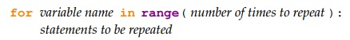

# A Practical Introduction to Python Programming by Brian Heinold

## Chapter 2: For Loops

Probably the most powerful thing about computers is that they can repeat things over and over very quickly. There are several ways to repeat things in Python, the most common of which is the for loop.

**Example 1** The following program will print `Hello` ten times:

```
for i in range(10):
    print('Hello')
```

The output:

```
Hello
Hello
Hello
Hello
Hello
Hello
Hello
Hello
Hello
Hello
```

### Syntax

The structure of a for loop is as follows:



The syntax is important here. The word `for` must be in lowercase, the first line must end with a colon, and the statements to be repeated must be indented. Indentation is used to tell Python which statements will be repeated.

**Example 2** The program below asks the user for a number and prints its square, then asks for another number and prints its square, etc. It does this three times and then prints that the loop is done.

```
for i in range(3):
    num = eval(input('Enter a number: '))
    print ('The square of your number is', num*num)
print('The loop is now done.')
```

The output:

```
Enter a number: 3 
The square of your number is 9
Enter a number: 5
The square of your number is 25
Enter a number: 23
The square of your number is 529
The loop is now done.
```

Since the second and third lines are indented, Python knows that these are the statements to be repeated. The fourth line is not indented, so it is not part of the loop and only gets executed once, after the loop has completed.

**Example 3** The program below will print A, then B, then it will alternate C’s and D’s five times and then finish with the letter E once.

```
print('A')
print('B')
for i in range(5):
    print('C')
    print('D')
print('E')
```

The output:

```
A
B
C
D
C
D
C
D
C
D
C
D
E
```

The first two print statements get executed once, printing an A followed by a B. Next, the C’s and D’s alternate five times. Note that we don’t get five C’s followed by five D’s. The way the loop works is we print a C, then a D, then loop back to the start of the loop and print a C and another D, etc. Once the program is done looping with the C’s and D’s, it prints one E

**Example 4** If we wanted the above program to print five C’s followed by five D’s, instead of alternating C’s and D’s, we could do the following:

```
print('A')
print('B')
for i in range(5):
    print('C')
for i in range(5):
    print('D')
print('E')
```

The Output:

```
A
B
C
C
C
C
C
D
D
D
D
D
E
```

### The Loop Variable

There is one part of a for loop that is a little tricky, and that is the loop variable. In the example below, the loop variable is the variable i. The output of this program will be the numbers `0, 1, . . . , 99`, each printed on its own line.

```
for i in range(100):
    print(i)
```

When the loop first starts, Python sets the variable `i` to 0. Each time we loop back up, Python increases the value of `i` by 1. The program loops 100 times, each time increasing the value of `i` by 1, until we have looped 100 times. At this point the value of `i` is 99.

Since the loop variable, i, gets increased by 1 each time through the loop, it can be used to keep track of where we are in the looping process. Consider the example below:

```
for i in range(3):
    print(i+1, '-- Hello')
```

The output:

```
1 -- Hello
2 -- Hello
3 -- Hello
```

**Names** There’s nothing too special about the name `i` for our variable. The programs below will have the exact same result.


It’s a convention in programming to use the letters `i`, `j`, and `k` for loop variables, unless there’s a good reason to give the variable a more descriptive name.

### The `range()` Function

The value we put in the `range` function determines how many times we will loop. The way `range` works is it produces a list of numbers from zero to the value minus one. For instance, `range`(5) produces five values: 0, 1, 2, 3, and 4. Here's the sample below:


Here is an example program that counts down from 5 and then prints a message

```
for i in range(5,0,-1):
    print(i, end=' ')
print('Blast off!!')
```

The Output:

```
5 4 3 2 1 Blast off!!
```

### Tricker Example for loop()

Let’s look at a problem where we will make use of the loop variable. The program below prints a rectangle of stars that is 4 rows tall and 6 rows wide.

```
for i in range(4):
    print('*'*6)    
```

The Output:

```
******
******
******
******
```

The key is to change the 6 to `i+1`. Each time through the loop the program will now print `i+1` stars instead of 6 stars. The loop counter variable `i` runs through the values 0, 1, 2, and 3. Using it allows
us to vary the number of stars. Here is triangle program:

```
for i in range(4):
    print('*'*(i+1))
```

The Output:

```
*
**
***
****
```

### Exercises

1. Write a program that prints your name 100 times.

Code:

```
name = "Edmon"

for i in range(100):
    print(name)
```

2. Write a program to fill the screen horizontally and vertically with your name. [Hint: add the option `end=''` into the `print` function to fill the screen horizontally.]

Code:

```
import shutil

name = "Edmon"

columns, lines = shutil.get_terminal_size()

for _ in range(lines):
    print(name * (columns // len(name)), end='')
```

3. Write a program that outputs 100 lines, numbered 1 to 100, each with your name on it. The output should look like the output below

```
1 Your name
2 Your name
3 Your name
4 Your name
...
100 Your name
```

Code:

```
name = "Edmon"

for i in range(1, 101):
    print(i, name)
```

4. Write a program that prints out a list of the integers from 1 to 20 and their squares. The output should look like this:

```
1 --- 1
2 --- 4
3 --- 9
...
20 --- 400
```

Code:

```
for i in range(1, 21):
    print(i, "---", i**2)
```

5. Write a program that uses a for loop to print the numbers 8, 11, 14, 17, 20, ..., 83, 86, 89.

Code:

```
for i in range(8, 90, 3):
    print(i)
```

6. Write a program that uses a for loop to print the numbers 100, 98, 96, ..., 4, 2.

Code:

```
for i in range(100, 0, -2):
    print(i)
```

7. Write a program that uses exactly four for loops to print the sequence of letters below.

```
AAAAAAAAAABBBBBBBCDCDCDCDEFFFFFFG
```

Code:

```
# Define the sequence of letters
sequence = "AAAAAAAAAABBBBBBBCDCDCDCDEFFFFFFG"

# Four nested for loops to print the sequence
for i in range(0, 10):
    print(sequence[i], end="")
for j in range(10, 18):
    print(sequence[j], end="")
for k in range(18, 25):
    print(sequence[k], end="")
for l in range(25, len(sequence)):
    print(sequence[l], end="")
```

8. Write a program that asks the user for their name and how many times to print it. The program should print out the user’s name the specified number of times.

Code:

```
name = input("Enter your name: ")

times = int(input("How many times do you want to print your name? "))

for _ in range(times):
    print(name)
```

9. The Fibonacci numbers are the sequence below, where the first two numbers are 1, and each number thereafter is the sum of the two preceding numbers. Write a program that asks the user how many Fibonacci numbers to print and then prints that many.

```
1, 1, 2, 3, 5, 8, 13, 21, 34, 55, 89...
```

Code:

```
def fibonacci(n):
    fibonacci_sequence = [1, 1] 

    for i in range(2, n):
        next_number = fibonacci_sequence[-1] + fibonacci_sequence[-2]  
        fibonacci_sequence.append(next_number) 

    return fibonacci_sequence

n = int(input("How many Fibonacci numbers do you want to print? "))

print("Fibonacci sequence:")
for number in fibonacci(n):
    print(number, end=", ")
```

10. Use a for loop to print a box like the one below. Allow the user to specify how wide and how high the box should be. [Hint: print('*'*10) prints ten asterisks.]

```
*******************
*******************
*******************
*******************
```

Code:

```
width = int(input("Enter the width of the box: "))
height = int(input("Enter the height of the box: "))

for _ in range(height):
    print("*" * width)
```

11. Use a for loop to print a box like the one below. Allow the user to specify how wide and how high the box should be.

```
*******************
*                 *
*                 *
*******************
```

Code:

```
width = int(input("Enter the width of the box: "))
height = int(input("Enter the height of the box: "))

for i in range(height):
    if i == 0 or i == height - 1:
        print("*" * width)  
    else:
        print("*", " " * (width - 2), "*", sep="")  
```

12. Use a for loop to print a triangle like the one below. Allow the user to specify how high the triangle should be.

```
*
**
***
****
```

Code:

```
height = int(input("Enter the height of the triangle: "))

for i in range(1, height + 1):
    print("*" * i)
```

13. Use a for loop to print an upside down triangle like the one below. Allow the user to specify how high the triangle should be.
```
****
***
**
*
```

Code:

```
# Ask the user for the height of the triangle
height = int(input("Enter the height of the triangle: "))

# Print the upside-down triangle
for i in range(height, 0, -1):
    print("*" * i)
```

14. Use for loops to print a diamond like the one below. Allow the user to specify how high the diamond should be.

```
    *
   ***
  *****
 *******
  *****
   ***
    *
```

Code:

```
height = int(input("Enter the height of the diamond: "))

# Upper triangle
for i in range(1, height + 1):
    print(" " * (height - i) + "*" * (2 * i - 1))

# Lower triangle
for i in range(height - 1, 0, -1):
    print(" " * (height - i) + "*" * (2 * i - 1))
```

15. Write a program that prints a giant letter A like the one below. Allow the user to specify how large the letter should be.

```
     *
    * *
   *****
  *     *
 *       *
```

Code:

```
# Ask the user for the size of the giant letter A
size = int(input("Enter the size of the giant letter A: "))

# Upper part of the letter A
for i in range(size):
    if i == 0:
        print(" " * (size - i - 1) + "*")
    elif i == size // 2:
        print(" " * (size - i - 1) + "*" * (2 * i + 1))
    else:
        print(" " * (size - i - 1) + "*" + " " * (2 * i - 1) + "*")
```
